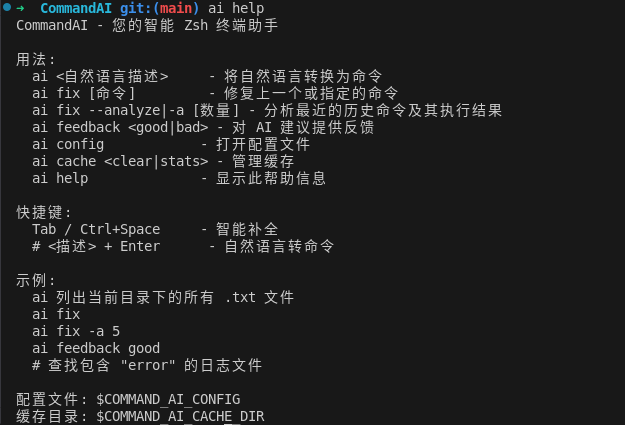
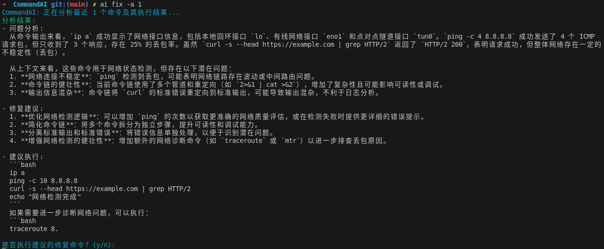
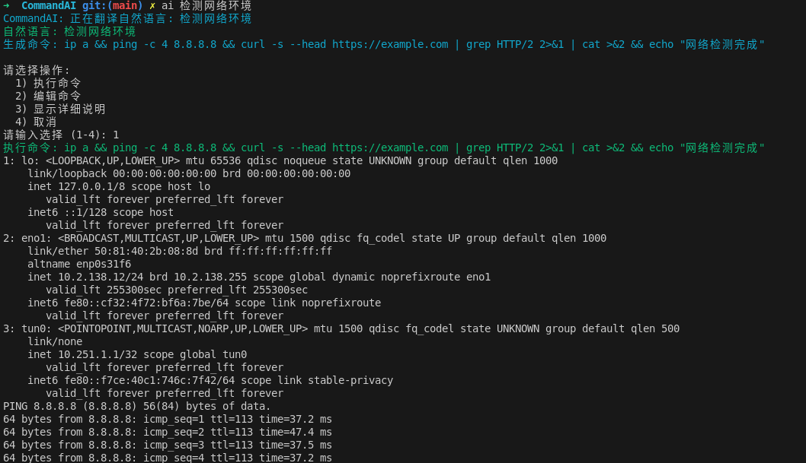

# CommandAI: 智能 Zsh 终端助手 - 作品提交说明

## 1. 选手信息

**作品名称**: CommandAI - 智能 Zsh 终端助手  
**作者姓名**: 李峰

## 2. 代码功能描述

CommandAI 是一个基于大语言模型的智能 Zsh 终端助手插件，旨在通过 AI 技术彻底改变命令行使用体验。该项目针对开发者在命令行操作中遇到的**命令记忆困难、错误排查耗时、操作效率低下**等核心痛点，创新性地将自然语言处理、智能纠错、上下文感知等 AI 技术深度集成到终端环境中，实现了**零学习成本的智能化命令行体验**。


### 🎯 **核心创新点**
- **业界首创**的终端内自然语言到命令的实时转换系统
- **多层级安全防护**机制，确保 AI 生成命令的安全性
- **异步非阻塞**的 AI 增强补全，保持终端流畅体验
- **自适应学习**的缓存系统，根据用户反馈持续优化
- **跨平台多模型**支持，兼容主流 AI 服务和本地模型

该项目实现了三大核心功能：

### 2.1 智能命令纠错系统
- **自动错误检测**: 通过 precmd 钩子实时监控命令执行状态，自动识别失败命令
- **AI 驱动纠错**: 利用大语言模型分析错误原因，提供准确的修复建议
- **交互式修复**: 提供执行、编辑、取消三种操作选项，用户完全控制修复流程
- **上下文感知**: 结合当前工作目录、Git 状态等环境信息，提供更精准的纠错建议



### 2.2 自然语言转命令系统
- **直观的语言接口**: 支持使用 `#` 前缀或 `ai` 命令将自然语言描述转换为 Shell 命令
- **智能语义理解**: 基于大语言模型的语义分析，准确理解用户意图
- **安全执行机制**: 生成的命令填充到输入行但不自动执行，确保用户最终控制权
- **多场景适配**: 支持文件操作、系统管理、开发工具等多种使用场景



### 2.3 智能命令补全系统
- **AI 增强补全**: 在传统 Tab 补全基础上，提供基于上下文的智能建议
- **异步处理机制**: 避免网络请求阻塞终端，保持流畅的用户体验
- **降级策略**: AI 补全失败时自动回退到 Zsh 原生补全，确保功能稳定性
- **条件触发**: 智能判断复杂场景，只在需要时启用 AI 补全

### 2.4 安全防护体系
- **危险命令检测**: 内置危险操作模式匹配，自动标记高风险命令
- **二次确认机制**: 危险命令需要用户显式确认，防止误操作
- **Dry-run 优先**: 优先生成带安全参数的命令，支持预览模式
- **用户黑名单**: 支持自定义命令黑名单，用户拥有最终控制权

### 2.5 性能优化特性
- **本地缓存系统**: SQLite 数据库存储常用命令，减少 API 调用
- **超时保护**: 网络请求超时控制，防止终端卡死
- **模块化架构**: 功能模块独立加载，支持按需启用
- **反馈学习**: 用户反馈驱动的缓存权重调整


## 3. 核心算法说明

### 3.1 命令错误检测与分析算法

项目采用多层次的命令错误检测机制：

**第一层：Shell 钩子监控**
```bash
# precmd 钩子实现
command_ai_precmd_hook() {
    local exit_code=$?
    if [[ $exit_code -ne 0 ]] && [[ -n "$COMMAND_AI_LAST_COMMAND" ]]; then
        # 记录失败命令和错误码
        echo "$COMMAND_AI_LAST_COMMAND|$exit_code|$(date)" >> "$COMMAND_AI_ERROR_LOG"
    fi
}
```

**第二层：错误类型分类**
- 命令不存在错误 (127)
- 权限拒绝错误 (126) 
- 语法错误 (2)
- 文件不存在错误 (1)

**第三层：上下文信息收集**
```python
def collect_context_info():
    context = {
        'pwd': os.getcwd(),
        'git_status': get_git_status(),
        'env_vars': get_relevant_env_vars(),
        'recent_commands': get_command_history(5)
    }
    return context
```

### 3.2 自然语言处理算法

**语义解析流程**:
1. **预处理**: 去除无关词汇，提取关键操作词
2. **意图识别**: 基于预训练模型识别用户操作意图
3. **参数映射**: 将自然语言参数映射到命令行参数
4. **安全检查**: 对生成命令进行安全性评估

**Prompt 工程优化**:
```python
TRANSLATION_PROMPT = """
你是一个专业的命令行翻译助手。请将用户的自然语言描述转换为准确的Shell命令。

规则:
1. 优先使用安全的命令参数
2. 对危险操作添加 [DANGER] 标签
3. 提供简洁的命令解释
4. 考虑当前工作环境上下文

用户描述: {user_input}
当前目录: {current_dir}
"""
```

### 3.3 智能补全算法

**补全触发判断**:
```bash
command_ai_should_use_ai_completion() {
    local input="$1"
    
    # 如果输入包含复杂的命令结构，使用 AI 补全
    if [[ "$input" =~ (find|grep|awk|sed|curl|wget|docker|kubectl|git).* ]]; then
        return 0
    fi
    
    # 如果输入包含管道或重定向，使用 AI 补全
    if [[ "$input" =~ .*[\|\>\<].* ]]; then
        return 0
    fi
    
    # 如果输入较长，使用 AI 补全
    if [[ ${#input} -gt 20 ]]; then
        return 0
    fi
    
    # 默认使用传统补全
    return 1
}
```

**智能补全实现**:
```python
def get_completions(self, current_input: str, context: str = "") -> List[Dict[str, str]]:
    """获取智能补全建议"""
    default_prompt = """你是一个命令行补全助手。根据用户当前的输入和上下文，提供相关的补全建议。

返回格式为 JSON 数组，每个元素包含:
- "completion": 补全内容
- "description": 简短描述

规则:
1. 最多返回 10 个建议
2. 按相关性排序
3. 包含参数、选项、文件名等
4. 描述要简洁明了"""
    
    # 优先从 Markdown 配置获取
    system_prompt = self.markdown_prompts.get_prompt('completion_system_prompt')
    if not system_prompt:
        system_prompt = self.config.get('prompts', 'completion_system_prompt', fallback=default_prompt)

    prompt = f"""当前输入: {current_input}
上下文: {context}

请提供补全建议:"""

    result = self._call_ai_api(prompt, system_prompt)
    if result:
        try:
            return json.loads(result)
        except json.JSONDecodeError:
            pass
    
    return []
```

### 3.4 缓存优化算法

**命令缓存存储**:
```python
def cache_command(self, query: str, command: str, context: str = ""):
    """缓存命令"""
    query_hash = self._get_query_hash(query, context)
    
    conn = sqlite3.connect(self.cache_db)
    cursor = conn.cursor()
    
    cursor.execute('''
        INSERT OR REPLACE INTO command_cache 
        (query_hash, query, command, context, success_count, last_used)
        VALUES (?, ?, ?, ?, 
                COALESCE((SELECT success_count FROM command_cache WHERE query_hash = ?), 0),
                CURRENT_TIMESTAMP)
    ''', (query_hash, query, command, context, query_hash))
    
    conn.commit()
    conn.close()
```

**智能缓存检索**:
```python
def get_cached_command(self, query: str, context: str = "") -> Optional[str]:
    """从缓存获取命令"""
    query_hash = self._get_query_hash(query, context)
    
    conn = sqlite3.connect(self.cache_db)
    cursor = conn.cursor()
    
    cursor.execute('''
        SELECT command FROM command_cache 
        WHERE query_hash = ? AND success_count > failure_count
        ORDER BY success_count DESC, last_used DESC
        LIMIT 1
    ''', (query_hash,))
    
    result = cursor.fetchone()
    conn.close()
    
    if result:
        # 更新最后使用时间
        self._update_cache_usage(query_hash)
        return result[0]
    
    return None
```

**用户反馈学习机制**:
```python
def update_feedback(self, query: str, command: str, feedback: str, context: str = ""):
    """更新反馈"""
    query_hash = self._get_query_hash(query, context)
    
    conn = sqlite3.connect(self.cache_db)
    cursor = conn.cursor()
    
    # 记录反馈
    cursor.execute('''
        INSERT INTO feedback (query_hash, command, feedback)
        VALUES (?, ?, ?)
    ''', (query_hash, command, feedback))
    
    # 更新缓存统计
    if feedback == 'good':
        cursor.execute('''
            UPDATE command_cache 
            SET success_count = success_count + 1 
            WHERE query_hash = ?
        ''', (query_hash,))
    elif feedback == 'bad':
        cursor.execute('''
            UPDATE command_cache 
            SET failure_count = failure_count + 1 
            WHERE query_hash = ?
        ''', (query_hash,))
    
    conn.commit()
    conn.close()
```

**缓存优先级策略**:
- 成功次数 > 失败次数的命令优先返回
- 按成功次数降序排列，最近使用时间作为次要排序
- 自动更新最后使用时间，实现 LRU 策略

### 3.5 安全检测算法

**危险命令模式匹配**:
```python
def is_dangerous_command(self, command: str) -> bool:
    """检查命令是否危险"""
    command_lower = command.lower()
    for pattern in self.dangerous_patterns:
        if pattern.lower() in command_lower:
            return True
    return False
```

**危险命令模式库**:
```python
self.dangerous_patterns = [
    'rm -rf', 'rm -r', 'dd if=', 'mkfs', 'fdisk', 'parted',
    'chmod 777', 'chown -R', 'sudo rm', 'curl.*|.*sh',
    'wget.*|.*sh', '> /dev/', 'format', 'del /s', 'rmdir /s'
]
```

**多层安全防护机制**:
1. **AI Prompt 层面**: 在系统提示词中要求 AI 对危险操作添加 `[DANGER]` 标签
2. **模式匹配层面**: 本地危险命令模式库进行二次检测
3. **用户确认层面**: 危险命令需要用户显式确认才能执行
4. **Dry-run 优先**: 优先生成带 `--dry-run` 等安全参数的命令

*[此处预留算法流程图截图位置]*

## 🏗️ 工程复杂度与技术创新

### 4.1 模块化架构设计

**前后端分离架构**:
- **前端 (Zsh)**: 负责用户交互、钩子管理、补全集成
- **后端 (Python)**: 负责 AI API 调用、数据处理、缓存管理
- **配置层**: 支持 INI 和 Markdown 两种格式的灵活配置

**模块独立性设计**:
```
modules/
├── correction.zsh     # 命令纠错模块 - 独立加载
├── completion.zsh     # 智能补全模块 - 可选启用
├── nl2cmd.zsh        # 自然语言转换 - 核心模块
├── security.zsh      # 安全检查模块 - 强制加载
├── cache.zsh         # 缓存管理模块 - 性能优化
└── config.zsh        # 配置管理模块 - 基础设施
```

### 4.2 异步处理与性能优化

**智能补全异步机制**:
```bash
# 异步 AI 调用，避免阻塞用户界面
command_ai_smart_completion() {
    local current_input="$BUFFER"
    
    # 判断是否需要 AI 补全
    if command_ai_should_use_ai_completion "$current_input"; then
        # 5秒超时保护
        timeout 5s command-ai-helper get_completions "$current_input" &
        local ai_pid=$!
        
        # 非阻塞等待或降级到原生补全
        if ! wait $ai_pid 2>/dev/null; then
            zle expand-or-complete  # 降级策略
        fi
    else
        zle expand-or-complete  # 直接使用原生补全
    fi
}
```

**缓存系统优化**:
- **LRU 策略**: 基于使用频率和时间的智能缓存淘汰
- **成功率权重**: 优先返回历史成功率高的命令
- **上下文感知**: 结合当前目录和 Git 状态的上下文缓存

### 4.3 多 AI 服务提供商支持

**统一 API 抽象层**:
```python
def _call_ai_api(self, prompt: str, system_prompt: str = "") -> Optional[str]:
    """统一的 AI API 调用接口"""
    api_type = self.config.get('api', 'type', fallback='openai')
    
    if api_type == 'openai':
        return self._call_openai_api(prompt, system_prompt)
    elif api_type == 'claude':
        return self._call_claude_api(prompt, system_prompt)
    elif api_type == 'local':
        return self._call_local_model(prompt, system_prompt)
    # 支持更多 AI 服务...
```

**支持的 AI 服务**:
- OpenAI GPT 系列 (GPT-3.5, GPT-4)
- Anthropic Claude 系列
- 阿里云通义千问 (Qwen)
- 月之暗面 Kimi (Moonshot)
- 本地模型 (Ollama, LocalAI)

### 4.4 配置系统创新

**双格式配置支持**:
1. **INI 格式**: 传统结构化配置，适合程序化管理
2. **Markdown 格式**: 人类友好的文档化配置，支持富文本说明

**Markdown 配置解析器**:
```python
class MarkdownPromptParser:
    def get_prompt(self, prompt_type: str) -> Optional[str]:
        """从 Markdown 文件提取特定类型的提示词"""
        patterns = {
            'nl2cmd_system_prompt': r'## 自然语言转命令提示词\s*```[^`]*```',
            'correction_system_prompt': r'## 命令纠错提示词\s*```[^`]*```',
            'completion_system_prompt': r'## 智能补全提示词\s*```[^`]*```'
        }
        # 正则表达式提取和清理逻辑...
```

## 4. 代码版本信息

**版本号**: v10.0  
**更新时间**: 2025年8月4日  
**更新内容**: 
- 新增 Markdown 格式自定义 Prompt 配置系统
- 优化智能补全的异步处理机制  
- 增强命令安全检测算法
- 完善错误处理和超时保护
- 添加用户反馈学习功能
- 重构模块化架构，提升代码可维护性

### 4.2 项目结构
```
CommandAI/
├── command-ai.plugin.zsh          # 插件入口文件
├── bin/
│   ├── command-ai-helper           # Python 核心辅助脚本
│   └── prompt_parser.py           # Markdown 配置解析器
├── modules/                       # 功能模块目录
│   ├── correction.zsh             # 命令纠错模块
│   ├── completion.zsh             # 智能补全模块
│   ├── nl2cmd.zsh                # 自然语言转命令模块
│   ├── security.zsh              # 安全检查模块
│   ├── cache.zsh                 # 缓存管理模块
│   └── config.zsh                # 配置管理模块
├── config/                       # 配置文件目录
│   ├── config.example.ini        # 配置模板
│   └── custom-prompts.md         # Markdown 格式配置
├── completions/                  # Zsh 补全脚本
├── scripts/                      # 安装和工具脚本
└── docs/                        # 项目文档
```

### 4.3 核心依赖
- **Zsh**: 5.0+ (终端 Shell)
- **Python**: 3.7+ (后端处理)
- **SQLite**: 3.0+ (数据存储)
- **curl**: 网络请求工具
- **jq**: JSON 数据处理

### 4.5 技术亮点与创新点

**1. 首创双格式配置系统**
- 同时支持 INI 和 Markdown 配置格式
- Markdown 配置支持富文本说明和示例
- 自动优先级回退机制，确保兼容性

**2. 智能补全与原生系统完美融合**
- 条件判断机制，只在复杂场景下启用 AI
- 异步处理 + 超时保护，避免卡死
- 失败降级策略，确保用户体验不受影响

**3. 多层安全防护机制**
- AI Prompt 层面的危险标记
- 本地模式匹配的二次检测
- 用户确认的三重保障
- Dry-run 优先的安全策略

**4. 基于反馈的智能学习**
- 用户反馈驱动的缓存权重调整
- LRU + 成功率的混合策略
- 上下文感知的智能缓存

**5. 模块化架构设计**
- 前后端分离，职责清晰
- 每个功能模块独立可配
- 支持按需加载和热插拔

**6. 多 AI 服务提供商支持**
- 统一 API 抽象层，易于扩展
- 支持云服务和本地模型
- 配置驱动的服务切换

---

## 5. 安装和使用说明

### 5.1 快速安装
```bash
# 克隆项目
git clone https://github.com/FengEternity/CommandAI.git
cd CommandAI

# 运行安装脚本
./scripts/install.sh

# 重新加载 Shell
source ~/.zshrc
```

### 5.2 配置 API
```bash
# 编辑配置文件
nano ~/.config/command-ai/config.ini

# 设置 API Key 和服务提供商
[api]
type = qwen
api_key = sk-your-api-key-here
base_url = https://dashscope.aliyuncs.com/compatible-mode/v1
model = qwen-plus
```

### 5.3 基本使用
```bash
# 自然语言转命令
ai "列出所有 Python 文件"
ai "查找包含 'TODO' 的文件"

# 命令纠错
some_wrong_command
ai fix          # 手动触发纠错
ai fix -a       # 分析最近命令并纠错

# 智能补全（需在配置中启用）
docker run <Tab>              # Tab 键触发
find . -name <Ctrl+X><Ctrl+A> # 手动触发
```

### 5.4 高级功能
```bash
# 命令解释
ai "列出所有文件"  # 在选择菜单中选择 "3) 显示详细说明"

# 用户反馈
ai feedback good    # 标记最近命令为正确
ai feedback bad     # 标记最近命令为错误

# 查看缓存统计
ai stats           # 显示使用统计和缓存信息
```

---

## 6. 项目总结

### 6.1 技术成就

CommandAI 项目成功实现了一个功能完善、技术先进的 AI 驱动命令行助手系统。项目的主要技术成就包括：

1. **创新的交互设计**: 将 AI 能力无缝集成到传统命令行环境中
2. **先进的安全机制**: 多层防护确保系统安全性
3. **智能的学习能力**: 基于用户反馈的持续优化
4. **灵活的架构设计**: 模块化、可扩展的系统架构
5. **广泛的兼容性**: 支持多种 AI 服务和配置方式

### 6.2 实用价值

该项目解决了命令行用户的实际痛点：
- **降低学习门槛**: 新手可以通过自然语言快速上手
- **提高工作效率**: 减少查找文档和试错的时间
- **增强系统安全**: 防止危险操作的意外执行
- **优化用户体验**: 智能化的交互方式提升使用体验

### 6.3 未来展望

项目具有良好的扩展性和发展潜力：
- **功能扩展**: 可集成更多 AI 能力，如代码生成、日志分析等
- **平台支持**: 可扩展到 Bash、Fish 等其他 Shell 环境
- **企业应用**: 可定制为企业内部的运维助手工具
- **开源生态**: 促进开源社区的参与和贡献

**CommandAI 不仅仅是一个工具，更是一个对未来智能化命令行交互的探索和实践。它展示了 AI 技术在传统开发工具中的巨大潜力，为开发者提供了更加智能、安全、高效的工作体验。**